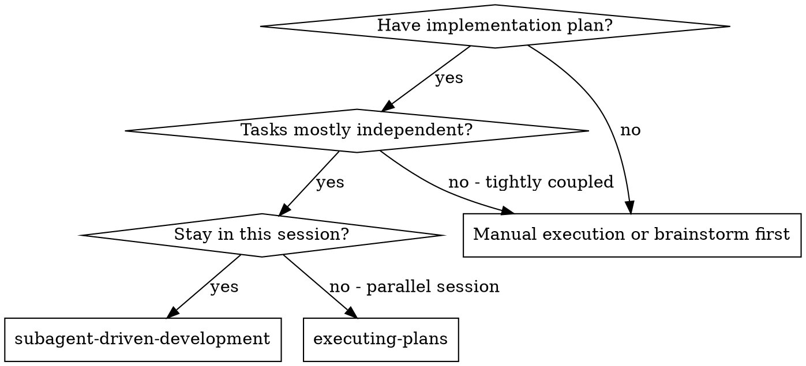
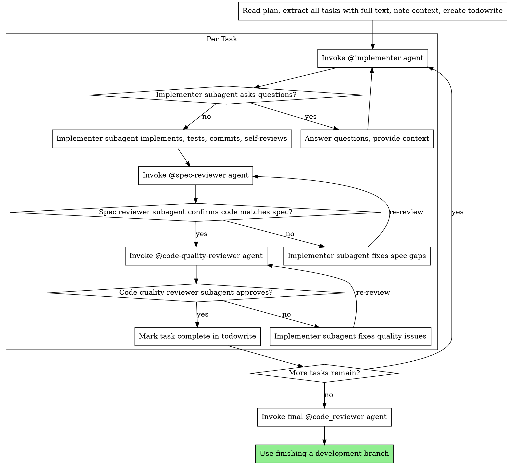

# Subagent-Driven Development

Execute plan by dispatching fresh subagent per task, with two-stage review after each: spec compliance review first, then code quality review.

**Core principle:** Fresh subagent per task + two-stage review (spec then quality) = high quality, fast iteration

## When to Use



**vs. Executing Plans (parallel session):**
- Same session (no context switch)
- Fresh subagent per task (no context pollution)
- Two-stage review after each task: spec compliance first, then code quality
- Faster iteration (no human-in-loop between tasks)

## The Process



## How to Invoke Subagents

To dispatch a subagent, you will use the `@<agent-name>` syntax. The general workflow for each dispatch is:
1.  **Read the appropriate prompt template** from the list below using the `read` tool.
2.  **Construct the full prompt** by replacing the placeholders in the template with the required information (task description, context, SHAs, etc.).
3.  **Invoke the agent** by creating a message that starts with the agent's name (e.g., `@implementer`) followed by the fully constructed prompt.

## Prompt Templates

-   `./implementer-prompt.md` - The prompt for the `@implementer` agent.
-   `./spec-reviewer-prompt.md` - The prompt for the `@spec-reviewer` agent.
-   `./code-quality-reviewer-prompt.md` - Instructions for invoking the `@code_reviewer` agent.

## Example Workflow

```
You: I'm using Subagent-Driven Development to execute this plan.

[Read plan file once: docs/plans/feature-plan.md]
[Extract all 5 tasks with full text and context]
[Create todowrite with all tasks]

---
**Task 1: Hook installation script**
---

You:
@implementer

You are implementing Task 1: Hook installation script

## Task Description
[Full text of Task 1 from the plan...]

## Context
[Scene-setting context for Task 1...]

---
Implementer: "Before I begin - should the hook be installed at user or system level?"

You: "User level (~/.config/expert-mode/hooks/)"

Implementer: "Got it. Implementing now..."
[Later]
Implementer:
  - Implemented install-hook command
  - Added tests, 5/5 passing
  - Self-review: Found I missed --force flag, added it
  - Committed

---
You:
@spec-reviewer

You are reviewing whether an implementation matches its specification.

## What Was Requested
[Full text of Task 1 requirements...]

## What Implementer Claims They Built
[Implementer's report from above...]

---
Spec reviewer: ✅ Spec compliant - all requirements met, nothing extra

---
You:
@code-quality-reviewer

[Constructs the prompt for the code quality reviewer by reading and filling out the templates as described in './code-quality-reviewer-prompt.md']

---
Code reviewer: Strengths: Good test coverage, clean. Issues: None. Approved.

[Mark Task 1 complete]

---
**Task 2: Recovery modes**
---

[...The process repeats for Task 2...]
```

## Advantages

**vs. Manual execution:**
- Subagents follow TDD naturally
- Fresh context per task (no confusion)
- Parallel-safe (subagents don't interfere)
- Subagent can ask questions (before AND during work)

**vs. Executing Plans:**
- Same session (no handoff)
- Continuous progress (no waiting)
- Review checkpoints automatic

**Efficiency gains:**
- No file reading overhead (controller provides full text)
- Controller curates exactly what context is needed
- Subagent gets complete information upfront
- Questions surfaced before work begins (not after)

**Quality gates:**
- Self-review catches issues before handoff
- Two-stage review: spec compliance, then code quality
- Review loops ensure fixes actually work
- Spec compliance prevents over/under-building
- Code quality ensures implementation is well-built

**Cost:**
- More subagent invocations (implementer + 2 reviewers per task)
- Controller does more prep work (extracting all tasks upfront)
- Review loops add iterations
- But catches issues early (cheaper than debugging later)

## Red Flags

**Never:**
- Skip reviews (spec compliance OR code quality)
- Proceed with unfixed issues
- Dispatch multiple implementation subagents in parallel (conflicts)
- Make subagent read plan file (provide full text instead)
- Skip scene-setting context (subagent needs to understand where task fits)
- Ignore subagent questions (answer before letting them proceed)
- Accept "close enough" on spec compliance (spec reviewer found issues = not done)
- Skip review loops (reviewer found issues = implementer fixes = review again)
- Let implementer self-review replace actual review (both are needed)
- **Start code quality review before spec compliance is ✅** (wrong order)
- Move to next task while either review has open issues

**If subagent asks questions:**
- Answer clearly and completely
- Provide additional context if needed
- Don't rush them into implementation

**If reviewer finds issues:**
- Implementer (same subagent) fixes them
- Reviewer reviews again
- Repeat until approved
- Don't skip the re-review

**If subagent fails task:**
- Dispatch fix subagent with specific instructions
- Don't try to fix manually (context pollution)

## Integration

**Required workflow skills:**
- **writing-plans** - Creates the plan this skill executes
- **requesting-code-review** - Code review template for reviewer subagents
- **finishing-a-development-branch** - Complete development after all tasks

**Subagents should use:**
- **test-driven-development** - Subagents follow TDD for each task

**Alternative workflow:**
- **executing-plans** - Use for parallel session instead of same-session execution
